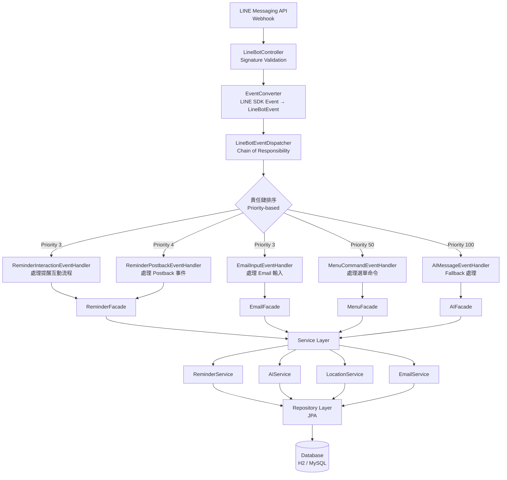
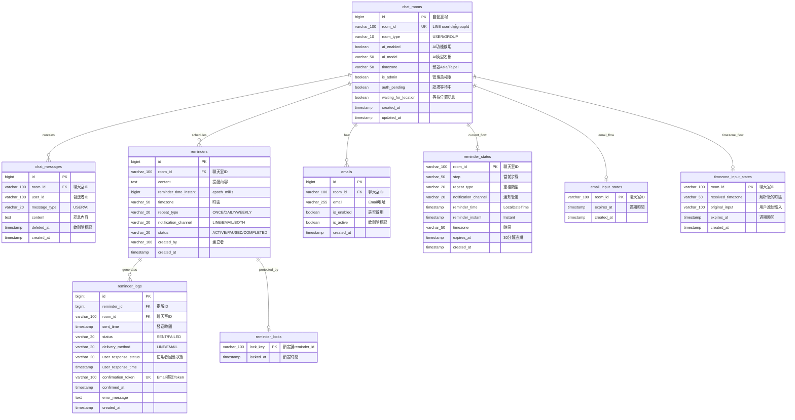

# NexusBot

基於 Spring Boot 的 LINE Bot 應用，整合 AI 對話、智能提醒、Email 通知等功能。採用事件驅動架構與責任鏈模式，支援多實例部署與分散式協調。

[](https://spring.io/projects/spring-boot)
[](https://adoptium.net/)
[](https://github.com/line/line-bot-sdk-java)
[](https://gradle.org/)

## 目錄

- [技術棧](#技術棧)
- [快速開始](#快速開始)
- [架構設計](#架構設計)
- [核心功能](#核心功能)
- [資料庫設計](#資料庫設計)
- [開發指南](#開發指南)
- [測試](#測試)
- [部署](#部署)

---

## 技術棧

### 後端框架

- **Spring Boot**: 3.4.3
- **Java**: 17
- **LINE Bot SDK**: 6.0.0
- **Spring Cloud**: 2024.0.0 (含 Bootstrap 配置)
- **Spring Data JPA**: ORM 層
- **Spring WebFlux WebClient**: 整合外部 API (Groq AI, OpenStreetMap)

### 資料庫

- **H2**: 本地開發與測試
- **MySQL**: 8.3.0（生產環境）
- **Flyway**: 資料庫版本化遷移管理
- **JPA/Hibernate**: ORM 框架

### 第三方整合

- **Groq API**: AI 對話服務
- **OpenStreetMap Overpass API**: 地理位置服務
- **JavaMail (SMTP)**: Email 通知
- **Thymeleaf**: HTML 模板引擎

### 建置與監控

- **Gradle**: 8.9 with Kotlin DSL
- **SpringDoc OpenAPI**: API 文件與 Swagger UI
- **SLF4J + Logback**: 日誌框架（非同步輸出 + TraceId 追蹤）

---

## 快速開始

### 前置需求

- **JDK 17+**
- **MySQL 8.x** (生產環境) 或使用內建 H2 (本地開發)
- **LINE Developer Account** ([申請連結](https://developers.line.biz/))
- **Groq API Key** ([申請連結](https://groq.com/))
- **SMTP Email Account** (Gmail 或其他 SMTP 服務)

### 安裝步驟

**1. Clone 專案**

```bash
git clone https://github.com/AceNexus/nexusbot.git
cd nexusbot
```

**2. 修改環境變數**

`src/main/resources/bootstrap-local.yml`：

```yaml
line:
  bot:
  channel-token: YOUR_LINE_CHANNEL_TOKEN
  channel-secret: YOUR_LINE_CHANNEL_SECRET

groq:
  api-key: YOUR_GROQ_API_KEY

email:
  host: smtp.gmail.com
  port: 587
  username: your-email@gmail.com
  password: your-app-password # Gmail App Password
  from: your-email@gmail.com
  from-name: NexusBot 提醒通知
```

或使用環境變數：

```bash
export LINE_CHANNEL_TOKEN="your_line_token"
export LINE_CHANNEL_SECRET="your_line_secret"
export GROQ_API_KEY="your_groq_key"
```

**3. 啟動應用**

```bash
# 清理並建置
./gradlew clean build

# 啟動應用 (預設 port 5001)
./gradlew bootRun
```

**4. 驗證運作**

- **應用程式**: http://localhost:5001
- **H2 Console**: http://localhost:5001/h2-console
    - JDBC URL: `jdbc:h2:file:./data/testdb`
    - Username: `sa`
    - Password: (留空)
- **Swagger UI**: http://localhost:5001/swagger-ui.html

**5. 設定 LINE Webhook 測試**

- 使用 [ngrok](https://ngrok.com/) 建立公開 URL：

 ```bash
 ngrok http 5001
 ```

- 在 LINE Developers Console 設定 Webhook URL：

 ```
 https://xxx.ngrok-free.app/webhook
 ```

---

## 架構設計

### 核心架構模式

- 專案採用 **事件驅動架構 (Event-Driven Architecture)** 與 **責任鏈模式 (Chain of Responsibility)** 處理 LINE Bot 事件。

#### 為什麼選擇事件驅動 + 責任鏈模式？

- **傳統方案的問題**：

單一巨型 Handler 難以維護：

```java
// 傳統方案：所有邏輯集中在一個 Handler
public void handleLineEvent(Event event) {
    if (event instanceof MessageEvent) {
        MessageEvent msgEvent = (MessageEvent) event;
        String text = msgEvent.getMessage().getText();

        // if-else 判斷
        if (text.startsWith("/menu")) {
            // 選單處理
        } else if (text.startsWith("/auth")) {
            // 認證處理
        } else if (isUserInReminderCreationFlow(userId)) {
            // 提醒建立流程
            if (currentStep == TIME_INPUT) {
                // 時間輸入處理
            } else if (currentStep == CONTENT_INPUT) {
                // 內容輸入處理
            }
        } else if (isAIEnabled(roomId)) {
            // AI 對話處理
        }
    } else if (event instanceof PostbackEvent) {
        // Postback 處理
    }
}
```

**問題點**：

- **單一職責原則違反**：一個類別負責所有事件類型
- **開放封閉原則違反**：新增功能需修改主 Handler
- **測試困難**：需要模擬所有場景
- **耦合度高**：所有邏輯互相依賴

---

**責任鏈方案**：

```java
// 責任鏈方案：每個 Handler 職責單一
public interface LineBotEventHandler {
    boolean canHandle(LineBotEvent event); // 判斷是否處理
    Message handle(LineBotEvent event); // 執行處理邏輯
    int getPriority(); // 優先級
}

// 範例 1：提醒互動 Handler
@Component
public class ReminderInteractionEventHandler implements LineBotEventHandler {
    @Override
    public boolean canHandle(LineBotEvent event) {
        // 檢查使用者是否在提醒建立流程中
        return reminderStateManager.getCurrentStep(event.getRoomId()) != null;
    }

    @Override
    public Message handle(LineBotEvent event) {
        return reminderFacade.handleInteraction(event.getRoomId(), event.getMessageText());
    }

    @Override
    public int getPriority() {
        return 5;
    }
}

// 範例 2：AI 對話 Handler
@Component
public class AIMessageEventHandler implements LineBotEventHandler {
    @Override
    public boolean canHandle(LineBotEvent event) {
        return event.getEventType() == EventType.MESSAGE && aiSettingsManager.isAIEnabled(event.getRoomId());
    }

    @Override
    public Message handle(LineBotEvent event) {
        return aiFacade.chat(event.getRoomId(), event.getMessageText());
    }

    @Override
    public int getPriority() {
        return 100;
    }
}
```

**優勢**：

- **職責單一**：每個 Handler 只處理一種場景
- **開放封閉**：新增功能只需新增 Handler，無需修改 Dispatcher
- **易於測試**：每個 Handler 可獨立單元測試
- **優先級控制**：狀態型 Handler 優先於通用 Handler

---

### 架構流程圖



---

### 關鍵設計決策

#### 1. 為什麼不使用外鍵約束？

**決策**：資料庫層完全不設外鍵，在應用層強制資料完整性

**理由**：

- **寫入效能提升**：避免外鍵驗證的額外查詢與鎖定
- **Flyway 遷移簡化**：修改表結構時無需處理複雜依賴

**配套措施**：

- Repository 層統一邏輯
- Flyway 嚴格版本管理

---

#### 2. 為什麼分散式鎖使用資料庫而非 Redis？

**決策**：基於 MySQL 的樂觀鎖（`reminder_locks` 表）

**理由**：

- **依賴最小化**：已有 MySQL，無需額外維護 Redis
- **故障隔離**：Redis 故障會導致所有鎖失效
- **一致性**：資料庫事務保證鎖的強一致性

**實作方式**：

```java
// DistributedLock.java
public boolean acquireLock(String lockKey, long timeoutMs) {
    try {
        ReminderLock lock = new ReminderLock();
        lock.setLockKey(lockKey);
        lock.setLockedAt(LocalDateTime.now());
        reminderLockRepository.save(lock); // UNIQUE KEY 自動防止重複
        return true;
    } catch (DataIntegrityViolationException e) {
        return false; // 已被鎖定
    }
}
```

**已知限制**：

- 目前用資料庫鎖簡單穩定，但高流量下效能可能不足，未來可改用 Redis 提升併發處理能力。

---

#### 3. 為什麼使用日誌追蹤（TraceId）？

**決策**：每個 HTTP 請求自動生成 TraceId，並傳播至非同步任務

**理由**：

- **問題定位**：快速追蹤單一請求的完整處理流程
- **非同步追蹤**：MDC（Mapped Diagnostic Context）機制確保 TraceId 傳播至 CompletableFuture
- **分散式追蹤準備**：預留 `X-Trace-Id` Header 供未來微服務使用

**實作範例**：

```java
// TraceIdFilter.java - 自動產生 TraceId
@Override
protected void doFilterInternal(HttpServletRequest request, ...) {
    String traceId = UUID.randomUUID().toString().substring(0, 8);
    MDC.put("traceId", traceId);
    // ... 處理請求
    MDC.clear();
}

// MdcTaskDecorator.java - 傳播至非同步任務
@Override
public Runnable decorate(Runnable runnable) {
    Map<String, String> contextMap = MDC.getCopyOfContextMap();
    return () -> {
        MDC.setContextMap(contextMap); // 恢復 TraceId
        runnable.run();
        MDC.clear();
    };
}
```

**日誌範例**：

```
[2025-01-15 10:30:00.123] [abc123de] [INFO] [ReminderScheduler] - Processing reminder 12345
[2025-01-15 10:30:00.234] [abc123de] [INFO] [DistributedLock] - Acquired lock: reminder:12345
[2025-01-15 10:30:00.345] [abc123de] [INFO] [LineNotificationService] - Sent to U1234567890
```

---

## 核心功能

### 1. AI 對話

整合 Groq API 提供智能對話功能：

- **多模型支援**
- **上下文管理**：保留最近 15 則對話歷史
- **Per-room 設定**：每個聊天室可獨立開關 AI 功能
- **AI 增強提醒**：提醒內容自動 AI 優化，產生友善化建議

**使用範例**：

```
使用者: "幫我總結今天的新聞"
Bot: [呼叫 Groq API，回傳 AI 生成內容]
```

---

### 2. 智能提醒

支援跨時區精準排程的提醒系統：

- **時區支援**：Instant-based 儲存，確保絕對時間點一致性
- **重複類型**：單次 (ONCE) / 每日 (DAILY) / 每週 (WEEKLY)
- **多通道通知**：LINE / Email / 雙重通知
- **分散式協調**：多實例環境下防止重複發送
- **AI 增強**：提醒內容自動優化為友善訊息

**建立流程**：

1. 選擇重複類型 (單次/每日/每週)
2. 選擇通知管道 (LINE/Email/雙重)
3. 輸入提醒時間 (支援自然語言：「明天下午3點」)
4. 輸入提醒內容
5. 系統自動排程，到期發送通知

**Cron 排程**：

```java

@Scheduled(cron = "0 * * * * *") // 每分鐘整分執行
public void processReminders() {
    // 查詢到期提醒 → 取得分散式鎖 → 發送通知 → 更新下次提醒時間
}
```

---

### 3. Email 通知

支援 Email 提醒與確認機制：

- **SMTP 整合**：JavaMail + Thymeleaf HTML 範本
- **確認連結**：Email 包含確認連結，點擊後記錄已讀
- **雙重通知**：可同時透過 LINE 與 Email 發送
- **AI 增強內容**：Email 也包含 AI 優化的友善提示

**Email 範本範例**：

```html
<h2> 提醒通知</h2>
<div>提醒內容：記得開會</div>
<div> 貼心小提醒：別忘了準備會議資料</div>
<a href="https://xxx/reminder/confirm/{token}">確認已收到</a>
```

---

### 4. 位置服務

整合 OpenStreetMap Overpass API：

- **附近廁所搜尋**：根據使用者位置搜尋附近公共廁所
- **設施查詢**：餐廳、咖啡廳、便利商店等設施
- **距離計算**：自動計算與使用者的直線距離
- **LINE Carousel 展示**：最多顯示 10 個結果

**查詢範例**：

```
使用者: [傳送位置訊息]
Bot: [顯示附近 5 個公共廁所，含距離與地圖連結]
```

---

### 5. 管理員功能

1. 使用者輸入 `/auth`
2. 系統產生動態密碼
3. 使用者回覆密碼
4. 驗證通過後標記為管理員

---

## 資料庫設計

### 設計原則

- **無外鍵約束**：提升寫入效能，應用層控制完整性
- **索引策略**：覆蓋常用查詢路徑，避免過度索引
- **跨資料庫相容**：支援 H2 (本地) 與 MySQL (生產)
- **Flyway 版本管理**：所有變更透過遷移檔案追蹤
- **軟刪除**：`chat_messages` 使用 `deleted_at` 標記

---

### 主要資料表

<details>
<summary><b> 點擊展開查看所有資料表 (9 張主表)</b></summary>

#### 1. chat_rooms - 聊天室配置表

| 欄位                     | 類型           | 說明                             |
|------------------------|--------------|--------------------------------|
| `id`                   | BIGINT       | 主鍵 (自動遞增)                      |
| `room_id`              | VARCHAR(100) | 聊天室 ID (LINE userId 或 groupId) |
| `room_type`            | VARCHAR(10)  | 類型 (USER / GROUP)              |
| `ai_enabled`           | BOOLEAN      | AI 功能是否啟用                      |
| `ai_model`             | VARCHAR(50)  | AI 模型名稱                        |
| `timezone`             | VARCHAR(50)  | 時區 (預設 Asia/Taipei)            |
| `is_admin`             | BOOLEAN      | 是否為管理員                         |
| `auth_pending`         | BOOLEAN      | 認證等待中                          |
| `waiting_for_location` | BOOLEAN      | 等待位置訊息                         |
| `created_at`           | TIMESTAMP    | 建立時間                           |
| `updated_at`           | TIMESTAMP    | 更新時間                           |

**索引**：

- `idx_chat_rooms_room_id` (room_id)
- `idx_chat_rooms_ai_enabled` (ai_enabled)

---

#### 2. chat_messages - 對話歷史表

| 欄位                   | 類型           | 說明                   |
|----------------------|--------------|----------------------|
| `id`                 | BIGINT       | 主鍵                   |
| `room_id`            | VARCHAR(100) | 聊天室 ID               |
| `room_type`          | VARCHAR(10)  | 聊天室類型 (冗余)           |
| `user_id`            | VARCHAR(100) | 發送者 ID (AI 訊息為 null) |
| `message_type`       | VARCHAR(20)  | 訊息類型 (USER / AI)     |
| `content`            | TEXT         | 訊息內容                 |
| `tokens_used`        | INTEGER      | AI 使用的 tokens 數量     |
| `processing_time_ms` | INTEGER      | AI 處理時間 (毫秒)         |
| `ai_model`           | VARCHAR(50)  | 使用的 AI 模型            |
| `deleted_at`         | TIMESTAMP    | 軟刪除標記 (NULL 表示未刪除)   |
| `created_at`         | TIMESTAMP    | 建立時間                 |

**索引**：

- `idx_chat_messages_room_not_deleted` (room_id, deleted_at)

**設計**：軟刪除設計，保留完整對話歷史供分析

---

#### 3. reminders - 提醒設定表

| 欄位                      | 類型           | 說明                           |
|-------------------------|--------------|------------------------------|
| `id`                    | BIGINT       | 主鍵                           |
| `room_id`               | VARCHAR(100) | 聊天室 ID                       |
| `content`               | TEXT         | 提醒內容                         |
| `reminder_time_instant` | BIGINT       | 提醒時間 (epoch millis)          |
| `timezone`              | VARCHAR(50)  | 時區                           |
| `repeat_type`           | VARCHAR(20)  | 重複類型 (ONCE/DAILY/WEEKLY)     |
| `notification_channel`  | VARCHAR(20)  | 通知管道 (LINE/EMAIL/BOTH)       |
| `status`                | VARCHAR(20)  | 狀態 (ACTIVE/PAUSED/COMPLETED) |
| `created_by`            | VARCHAR(100) | 建立者                          |
| `created_at`            | TIMESTAMP    | 建立時間                         |

**索引**：

- `idx_reminders_instant_status` (reminder_time_instant, status)
- `idx_reminders_room` (room_id)

**設計**：`reminder_time_instant` 儲存 epoch millis，確保跨時區一致性

---

#### 4. reminder_logs - 提醒發送日誌表

| 欄位                     | 類型           | 說明                |
|------------------------|--------------|-------------------|
| `id`                   | BIGINT       | 主鍵                |
| `reminder_id`          | BIGINT       | 提醒 ID             |
| `room_id`              | VARCHAR(100) | 聊天室 ID            |
| `sent_time`            | TIMESTAMP    | 發送時間              |
| `status`               | VARCHAR(20)  | 狀態 (SENT/FAILED)  |
| `delivery_method`      | VARCHAR(20)  | 發送方式 (LINE/EMAIL) |
| `user_response_status` | VARCHAR(20)  | 使用者回應狀態           |
| `user_response_time`   | TIMESTAMP    | 使用者回應時間           |
| `confirmation_token`   | VARCHAR(100) | Email 確認 Token    |
| `confirmed_at`         | TIMESTAMP    | Email 確認時間        |
| `error_message`        | TEXT         | 錯誤訊息              |
| `created_at`           | TIMESTAMP    | 建立時間              |

**索引**：

- `idx_logs_reminder` (reminder_id)
- `idx_logs_room_sent` (room_id, sent_time)

---

#### 5. reminder_states - 提醒建立流程狀態表

| 欄位                     | 類型           | 說明                   |
|------------------------|--------------|----------------------|
| `room_id`              | VARCHAR(100) | 聊天室 ID (主鍵)          |
| `step`                 | VARCHAR(50)  | 當前步驟                 |
| `repeat_type`          | VARCHAR(20)  | 重複類型                 |
| `notification_channel` | VARCHAR(20)  | 通知管道                 |
| `reminder_time`        | TIMESTAMP    | 提醒時間 (LocalDateTime) |
| `reminder_instant`     | TIMESTAMP    | 提醒時間 (Instant)       |
| `timezone`             | VARCHAR(50)  | 時區                   |
| `expires_at`           | TIMESTAMP    | 過期時間 (30 分鐘)         |
| `created_at`           | TIMESTAMP    | 建立時間                 |

**設計**：30 分鐘自動過期，避免殘留狀態

---

#### 6. reminder_locks - 分散式鎖表

| 欄位          | 類型           | 說明       |
|-------------|--------------|----------|
| `lock_key`  | VARCHAR(100) | 鎖定鍵 (主鍵) |
| `locked_at` | TIMESTAMP    | 鎖定時間     |

**索引**：

- `idx_locks_locked_at` (locked_at) - 方便過期清理

**設計**：極簡設計，依賴 UNIQUE KEY 自動防止重複

---

#### 7. emails - Email 地址管理表

| 欄位           | 類型           | 說明              |
|--------------|--------------|-----------------|
| `id`         | BIGINT       | 主鍵              |
| `room_id`    | VARCHAR(100) | 聊天室 ID          |
| `email`      | VARCHAR(255) | Email 地址        |
| `is_enabled` | BOOLEAN      | 是否啟用此信箱的通知      |
| `is_active`  | BOOLEAN      | 軟刪除標記 (true=有效) |
| `created_at` | TIMESTAMP    | 建立時間            |

**索引**：

- `idx_emails_room_id` (room_id)

---

#### 8. email_input_states - Email 輸入流程狀態表

| 欄位           | 類型           | 說明          |
|--------------|--------------|-------------|
| `room_id`    | VARCHAR(100) | 聊天室 ID (主鍵) |
| `expires_at` | TIMESTAMP    | 過期時間        |
| `created_at` | TIMESTAMP    | 建立時間        |

---

#### 9. timezone_input_states - 時區輸入流程狀態表

| 欄位                  | 類型           | 說明          |
|---------------------|--------------|-------------|
| `room_id`           | VARCHAR(100) | 聊天室 ID (主鍵) |
| `resolved_timezone` | VARCHAR(50)  | 解析後的時區      |
| `original_input`    | VARCHAR(100) | 使用者原始輸入     |
| `expires_at`        | TIMESTAMP    | 過期時間        |
| `created_at`        | TIMESTAMP    | 建立時間        |

</details>

---

### ER 關係圖（概念）



**註**：實際資料庫無外鍵約束，關聯由應用層管理

---

## 開發指南

### 專案結構

```
src/main/java/com/acenexus/tata/nexusbot/
├── ai/ # AI 整合模組
├── chatroom/ # 聊天室管理
├── config/ # 配置類別
├── constants/ # 常數定義
├── controller/ # REST API & Webhook
├── email/ # Email 管理
├── entity/ # JPA 實體
├── event/ # 事件處理核心
│ └── handler/ # 事件處理器 (25+ handlers)
├── facade/ # 門面層
├── lock/ # 分散式鎖
├── location/ # 位置服務
├── notification/ # 通知系統
├── reminder/ # 提醒核心
├── repository/ # JPA Repository
├── scheduler/ # 背景排程
├── security/ # 安全性
├── service/ # 服務層
├── template/ # 訊息範本
└── util/ # 工具類別
```

### 新增事件處理器

```java

@Component
@RequiredArgsConstructor
public class MyNewHandler implements LineBotEventHandler {

    @Override
    public boolean canHandle(LineBotEvent event) {
        // MUST BE PURE FUNCTION - 無副作用
        return event.getEventType() == EventType.MESSAGE
                && event.getMessageText().startsWith("/mycommand");
    }

    @Override
    public Message handle(LineBotEvent event) {
        // 執行業務邏輯
        return myFacade.doSomething(event.getRoomId());
    }

    @Override
    public int getPriority() {
        return 30; // 設定優先級
    }
}
```

**優先級建議**：

- 1-10：高優先級 (狀態型 Handler)
- 11-30：中優先級 (命令/Postback Handler)
- 31-50：一般優先級 (訊息 Handler)
- 51-99：低優先級 (Fallback Handler)

---

## 測試

### 測試策略

- **Handler 層**：單元測試 `canHandle()` 純函數，無需 Spring Context
- **Service 層**：整合測試驗證業務邏輯
- **Repository 層**：基於 H2 的資料存取測試

### 測試範例

```java

@Test
void canHandle_shouldReturnTrue_whenUserInReminderFlow() {
    // Given
    LineBotEvent event = LineBotEvent.builder()
            .roomId("U123")
            .eventType(EventType.MESSAGE)
            .build();

    when(reminderStateManager.getCurrentStep("U123"))
            .thenReturn(ReminderState.Step.WAITING_FOR_TIME);

    // When
    boolean result = handler.canHandle(event);

    // Then
    assertTrue(result);
}
```

---

## 部署

### Docker 部署

**建立 Dockerfile**：

**建置與執行**：

```bash
# 建立 Image
docker build -t nexusbot:latest .

# 執行容器
docker run -d \
 --name nexusbot \
 -p 5001:5001 \
 -e LINE_CHANNEL_TOKEN=your_token \
 -e LINE_CHANNEL_SECRET=your_secret \
 -e GROQ_API_KEY=your_key \
 -e SPRING_PROFILES_ACTIVE=prod \
 nexusbot:latest
```

---

## 參考文檔

- [LINE Messaging API](https://developers.line.biz/en/reference/messaging-api/)
- [Spring Boot Documentation](https://spring.io/guides/gs/spring-boot/)
- [Flyway Documentation](https://documentation.red-gate.com/flyway/)

---

## 授權

本專案為個人 Side Project，僅供學習與技術展示使用。