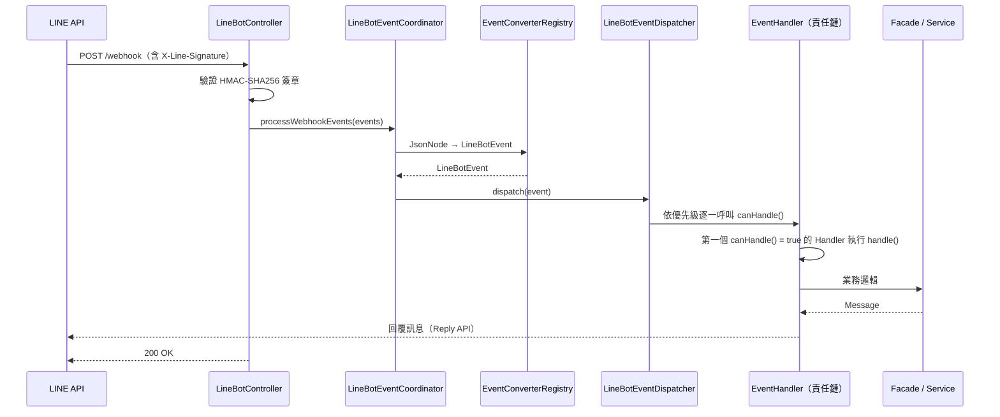
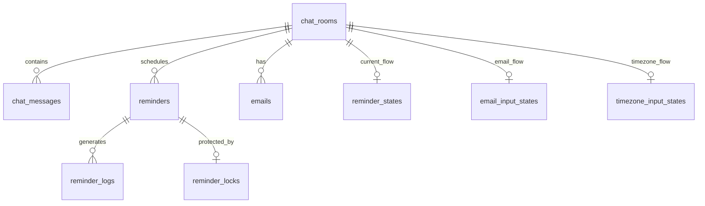

# NexusBot


基於 Spring Boot 的 LINE Bot 服務，採用責任鏈模式處理事件，整合 AI 對話、智能提醒、Email 通知與位置服務。

## 快速開始

### 前置需求

- Java 17
- Docker Desktop（完整微服務 stack）

### 使用 IntelliJ IDEA

1. `File` → `Open` → 選擇專案根目錄，等待 Gradle 同步完成
2. `Run` → `Edit Configurations` → `NexusbotApplication` → `Environment variables`
3. 輸入框貼上（填入實際值）：`LINE_CHANNEL_TOKEN=;LINE_CHANNEL_SECRET=;GROQ_API_KEY=;EMAIL_USERNAME=;EMAIL_PASSWORD=;EMAIL_FROM=`

| 變數                    | 說明                            |
|-----------------------|-------------------------------|
| `LINE_CHANNEL_TOKEN`  | LINE Bot Channel Access Token |
| `LINE_CHANNEL_SECRET` | LINE Bot Channel Secret       |
| `GROQ_API_KEY`        | Groq AI API Key               |
| `EMAIL_USERNAME`      | SMTP 帳號（Gmail）                |
| `EMAIL_PASSWORD`      | SMTP 密碼（Gmail App Password）   |
| `EMAIL_FROM`          | 寄件人地址                         |

> `local` profile 所有變數皆有預設值，可不填直接啟動，但 LINE 收發與 AI 功能需填入真實金鑰。

4. 點擊 `NexusbotApplication` 旁的 ▶ 啟動
5. 開啟 http://localhost:5001/actuator/health 確認回傳 `{"status":"UP"}`

**本地輔助端點**（`local` profile）：

| 端點                                    | 說明                                                             |
|---------------------------------------|----------------------------------------------------------------|
| http://localhost:5001/h2-console      | H2 Console（JDBC: `jdbc:h2:file:./data/testdb`，user: `sa`，密碼留空） |
| http://localhost:5001/swagger-ui.html | Swagger UI                                                     |

**LINE Webhook 測試**：使用 [ngrok](https://ngrok.com/) 建立公開 URL 並設定至 LINE Developers Console：

```bash
ngrok http 5001
# Webhook URL（直連）：https://xxx.ngrok-free.app/webhook
# Webhook URL（透過 Gateway）：https://xxx.ngrok-free.app/api/linebot/webhook
```

## 系統架構

### 請求處理流程



### 責任鏈 Handler 優先級

Handler 由 `LineBotEventDispatcher` 依優先級排序，數字越小越優先，第一個 `canHandle()` 回傳 `true` 的 Handler 負責處理。

| 優先級 | Handler                                                                                                                                                                          | 說明                          |
|-----|----------------------------------------------------------------------------------------------------------------------------------------------------------------------------------|-----------------------------|
| 1   | `AuthCommandEventHandler`                                                                                                                                                        | 認證指令（`/auth`）               |
| 2   | `AdminCommandEventHandler`、`AIPostbackEventHandler`、`TimezoneCommandEventHandler`                                                                                                | 管理員指令、AI Postback、時區設定指令    |
| 3   | `EmailInputEventHandler`、`EmailPostbackEventHandler`、`ReminderInteractionEventHandler`、`TimezoneInputEventHandler`、`TimezonePostbackEventHandler`                                | 輸入流程狀態攔截                    |
| 4   | `FollowHandler`、`UnfollowHandler`、`JoinGroupHandler`、`LeaveGroupHandler`、`MemberJoinedHandler`、`MemberLeftHandler`、`LocationPostbackEventHandler`、`ReminderPostbackEventHandler` | 生命週期事件與 Postback            |
| 5   | `AudioMessageEventHandler`、`FileMessageEventHandler`、`ImageMessageEventHandler`、`LocationMessageEventHandler`、`StickerMessageEventHandler`、`VideoMessageEventHandler`            | 非文字訊息                       |
| 10  | `NavigationPostbackEventHandler`                                                                                                                                                 | 導覽 Postback                 |
| 50  | `MenuCommandEventHandler`                                                                                                                                                        | 主選單指令                       |
| 100 | `AIMessageEventHandler`                                                                                                                                                          | AI 對話（Fallback，處理所有未被攔截的文字） |

**新增 Handler**：實作 `LineBotEventHandler`（`canHandle`、`handle`、`getPriority`），標註 `@Component`，Spring
自動掃描註冊。`canHandle()` 必須為純函數（無副作用）。

## 環境變數

| 變數                       | 預設值（local）              | 說明                              |
|--------------------------|-------------------------|---------------------------------|
| `SERVER_PORT`            | `5002`                  | 服務埠號                            |
| `SERVER_HOST`            | -                       | 實例對外主機位址（prod Eureka 自我註冊用）     |
| `SPRING_PROFILES_ACTIVE` | `local-eureka`          | 啟動環境（`local` / `local-eureka` / `prod`） |
| `LINE_CHANNEL_TOKEN`     | `default-token`         | LINE Bot Channel Access Token   |
| `LINE_CHANNEL_SECRET`    | `default-secret`        | LINE Bot Channel Secret         |
| `LINE_LIFF_ID`           | _(空)_                   | LIFF App ID                     |
| `GROQ_API_KEY`           | `default-groq-key`      | Groq AI API Key                 |
| `AI_HISTORY_LIMIT`       | `15`                    | AI 對話歷史保留則數                     |
| `EMAIL_USERNAME`         | `default@gmail.com`     | SMTP 帳號                         |
| `EMAIL_PASSWORD`         | `default-password`      | SMTP 密碼（Gmail 需使用 App Password） |
| `EMAIL_FROM`             | `default@gmail.com`     | 寄件人地址                           |
| `EMAIL_FROM_NAME`        | `NexusBot 提醒通知`         | 寄件人顯示名稱                         |
| `ADMIN_PASSWORD_SEED`    | `1103`                  | 管理員動態密碼種子                       |
| `NEXUSBOT_BASE_URL`      | `http://localhost:5001` | 服務本身的對外 URL（Email 確認連結用）        |
| `RABBITMQ_HOST`          | `localhost`             | RabbitMQ 主機位址                   |
| `RABBITMQ_PORT`          | `5672`                  | RabbitMQ 連接埠                    |
| `RABBITMQ_USERNAME`      | `admin`                 | RabbitMQ 帳號                     |
| `RABBITMQ_PASSWORD`      | `password`              | RabbitMQ 密碼                     |
| `CONFIG_SERVER_URI`      | -                       | Config Server 位址（prod）          |
| `CONFIG_SERVER_USERNAME` | -                       | Config Server 帳號（prod）          |
| `CONFIG_SERVER_PASSWORD` | -                       | Config Server 密碼（prod）          |
| `MYSQL_HOST`             | -                       | MySQL 主機位址（prod）                |
| `MYSQL_PORT`             | `3306`                  | MySQL 連接埠（prod）                 |
| `MYSQL_DATABASE`         | `nexusbot`              | MySQL 資料庫名稱（prod）               |
| `MYSQL_USERNAME`         | -                       | MySQL 帳號（prod）                  |
| `MYSQL_PASSWORD`         | -                       | MySQL 密碼（prod）                  |
| `EUREKA_SERVER_HOST`     | -                       | Eureka Server 主機位址（prod）        |
| `EUREKA_SERVER_PORT`     | `8761`                  | Eureka Server 連接埠（prod）         |

`local` profile 不需要 Config Server、MySQL、Eureka 連線，使用 H2 in-memory 資料庫，所有變數皆有預設值。

## 部署

以下指令在**部署目標主機**上執行，需已安裝 Docker 與 Docker Compose。

### 部署目錄結構

```
/opt/tata/nexusbot/
├── nexusbot.jar               # 編譯產出
├── Dockerfile                 # 來源：docs/docker/Dockerfile
├── .dockerignore              # 來源：docs/docker/.dockerignore
├── docker-compose.yml         # 來源：docs/docker/docker-compose.yml
└── .env                       # 來源：docs/docker/.env.example（填入實際值）
```

### 首次部署

1. 在專案開發機編譯 JAR：
   ```bash
   ./gradlew bootJar
   ```
2. 將 `build/libs/nexusbot-*.jar` 重新命名為 `nexusbot.jar`，與 `docs/docker/` 下的四個檔案一同複製至部署主機目錄
3. 將 `.env.example` 改名為 `.env`，填入實際設定值
4. 啟動：
   ```bash
   docker compose up -d
   ```

### 更新版本

1. 重新編譯 JAR，複製覆蓋至部署目錄
2. 重新建構並啟動：
   ```bash
   docker compose up -d --build
   ```

### 驗證

```bash
docker compose ps
curl http://localhost:5001/actuator/health
```

### 常用維運指令

| 指令                                | 說明        |
|-----------------------------------|-----------|
| `docker compose logs -f nexusbot` | 即時查看日誌    |
| `docker compose restart nexusbot` | 重啟服務      |
| `docker compose down`             | 停止並移除所有容器 |
| `docker compose build --no-cache` | 重新建構映像    |

## 版本管理

本專案採用 [Semantic Versioning](https://semver.org/)，以 **Git Tag 作為唯一版本來源**。

### 版號規則

| 版號位置  | 何時遞增         | 範例                  |
|-------|--------------|---------------------|
| MAJOR | 重大架構變更、技術棧升級 | `v1.0.0` → `v2.0.0` |
| MINOR | 新增功能、配置結構調整  | `v1.0.0` → `v1.1.0` |
| PATCH | Bug 修復、小幅調整  | `v1.0.0` → `v1.0.1` |

### 發版流程

```bash
./gradlew build                    # 1. 確認測試通過
git add <files>                    # 2. Commit 變更
git commit -m "[feat] 功能描述"
git tag v1.0.0                     # 3. 打 Tag 定版
git push && git push --tags        # 4. Push
```

### Commit 訊息格式

```
[類型] 中文描述
```

| 類型         | 說明        |
|------------|-----------|
| `feat`     | 新增功能      |
| `fix`      | 修復 Bug    |
| `refactor` | 重構（不影響功能） |
| `docs`     | 文件更新      |
| `test`     | 測試相關      |
| `config`   | 配置檔變更     |

## 參考資源

- [LINE Messaging API 官方文件](https://developers.line.biz/en/reference/messaging-api/)
- [Spring Boot 官方文件](https://docs.spring.io/spring-boot/docs/current/reference/html/)
- [Spring Cloud Config 官方文件](https://docs.spring.io/spring-cloud-config/docs/current/reference/html/)
- [Groq API 文件](https://console.groq.com/docs/openai)
- [Flyway 官方文件](https://documentation.red-gate.com/flyway/)

---

## 架構設計說明

### 核心架構模式

專案採用事件驅動架構（Event-Driven Architecture）與責任鏈模式（Chain of Responsibility）處理 LINE Bot 事件。

#### 傳統方案的問題

單一巨型 Handler 難以維護：

```java
// 傳統方案：所有邏輯集中在一個 Handler
public void handleLineEvent(Event event) {
    if (event instanceof MessageEvent) {
        String text = msgEvent.getMessage().getText();
        if (text.startsWith("/menu")) {
            // 選單處理
        } else if (text.startsWith("/auth")) {
            // 認證處理
        } else if (isUserInReminderCreationFlow(userId)) {
            if (currentStep == TIME_INPUT) { /* ... */ }
        } else if (isAIEnabled(roomId)) {
            // AI 對話處理
        }
    } else if (event instanceof PostbackEvent) {
        // Postback 處理
    }
}
```

**問題點**：單一職責違反、新增功能需修改主 Handler、測試困難、耦合度高。

#### 責任鏈方案

```java
public interface LineBotEventHandler {
    boolean canHandle(LineBotEvent event); // 純函數，無副作用

    Message handle(LineBotEvent event);

    int getPriority();
}

// 範例：提醒互動 Handler
@Component
public class ReminderInteractionEventHandler implements LineBotEventHandler {
    @Override
    public boolean canHandle(LineBotEvent event) {
        return reminderStateManager.getCurrentStep(event.getRoomId()) != null;
    }

    @Override
    public Message handle(LineBotEvent event) {
        return reminderFacade.handleInteraction(event.getRoomId(), event.getMessageText());
    }

    @Override
    public int getPriority() {
        return 3;
    }
}
```

**優勢**：職責單一、開放封閉、Handler 可獨立單元測試、優先級控制精確。

### 分散式鎖（DB-based）

使用 `reminder_locks` 表的 UNIQUE KEY 作為鎖機制，無需引入 Redis：

```java
public boolean acquireLock(String lockKey) {
    try {
        reminderLockRepository.save(new ReminderLock(lockKey));
        return true;
    } catch (DataIntegrityViolationException e) {
        return false; // 已被鎖定
    }
}
```

### TraceId 追蹤

每個 HTTP 請求自動生成 8 字元 TraceId（`TraceIdFilter`），並透過 `MdcTaskDecorator` 傳播至 `CompletableFuture` 非同步任務：

```
[2025-01-15 10:30:00.123] [INFO] [abc123de] [ReminderScheduler] - Processing reminder 12345
[2025-01-15 10:30:00.234] [INFO] [abc123de] [DistributedLock]   - Acquired lock: reminder:12345
```

---

## 資料庫設計

### 設計原則

- **無外鍵約束**：提升寫入效能，應用層控制完整性
- **Flyway 版本管理**：所有變更透過 `db/migration/V*.sql` 追蹤
- **跨資料庫相容**：H2（local）與 MySQL 8.x（prod）
- **時間儲存**：提醒時間以 `epoch millis`（`BIGINT`）儲存，確保跨時區一致性

### ER 關係圖



### 主要資料表

<details>
<summary><b>點擊展開（9 張主表）</b></summary>

#### chat_rooms

| 欄位                          | 類型              | 說明                    |
|-----------------------------|-----------------|-----------------------|
| `id`                        | BIGINT PK       | 自動遞增                  |
| `room_id`                   | VARCHAR(100) UK | LINE userId 或 groupId |
| `room_type`                 | VARCHAR(10)     | USER / GROUP          |
| `ai_enabled`                | BOOLEAN         | AI 功能啟用狀態             |
| `ai_model`                  | VARCHAR(50)     | AI 模型名稱               |
| `timezone`                  | VARCHAR(50)     | 時區（預設 Asia/Taipei）    |
| `is_admin`                  | BOOLEAN         | 管理員權限                 |
| `auth_pending`              | BOOLEAN         | 認證等待中                 |
| `waiting_for_location`      | BOOLEAN         | 等待位置訊息                |
| `created_at` / `updated_at` | TIMESTAMP       | 時間戳記                  |

#### chat_messages

| 欄位             | 類型           | 說明                  |
|----------------|--------------|---------------------|
| `id`           | BIGINT PK    |                     |
| `room_id`      | VARCHAR(100) | 聊天室 ID              |
| `user_id`      | VARCHAR(100) | 發送者 ID（AI 訊息為 null） |
| `message_type` | VARCHAR(20)  | USER / AI           |
| `content`      | TEXT         | 訊息內容                |
| `tokens_used`  | INTEGER      | AI tokens 用量        |
| `deleted_at`   | TIMESTAMP    | 軟刪除標記               |
| `created_at`   | TIMESTAMP    |                     |

#### reminders

| 欄位                      | 類型           | 說明                          |
|-------------------------|--------------|-----------------------------|
| `id`                    | BIGINT PK    |                             |
| `room_id`               | VARCHAR(100) | 聊天室 ID                      |
| `content`               | TEXT         | 提醒內容                        |
| `reminder_time_instant` | BIGINT       | epoch millis                |
| `timezone`              | VARCHAR(50)  | 時區                          |
| `repeat_type`           | VARCHAR(20)  | ONCE / DAILY / WEEKLY       |
| `notification_channel`  | VARCHAR(20)  | LINE / EMAIL / BOTH         |
| `status`                | VARCHAR(20)  | ACTIVE / PAUSED / COMPLETED |
| `created_by`            | VARCHAR(100) | 建立者                         |
| `created_at`            | TIMESTAMP    |                             |

#### reminder_logs

| 欄位                   | 類型              | 說明             |
|----------------------|-----------------|----------------|
| `id`                 | BIGINT PK       |                |
| `reminder_id`        | BIGINT          | 提醒 ID          |
| `room_id`            | VARCHAR(100)    | 聊天室 ID         |
| `sent_time`          | TIMESTAMP       | 發送時間           |
| `status`             | VARCHAR(20)     | SENT / FAILED  |
| `delivery_method`    | VARCHAR(20)     | LINE / EMAIL   |
| `confirmation_token` | VARCHAR(100) UK | Email 確認 Token |
| `confirmed_at`       | TIMESTAMP       | Email 確認時間     |
| `error_message`      | TEXT            | 錯誤訊息           |
| `created_at`         | TIMESTAMP       |                |

#### reminder_states

| 欄位                     | 類型              | 說明            |
|------------------------|-----------------|---------------|
| `room_id`              | VARCHAR(100) PK |               |
| `step`                 | VARCHAR(50)     | 當前步驟          |
| `repeat_type`          | VARCHAR(20)     | 重複類型          |
| `notification_channel` | VARCHAR(20)     | 通知管道          |
| `reminder_instant`     | TIMESTAMP       | 提醒時間（Instant） |
| `timezone`             | VARCHAR(50)     | 時區            |
| `expires_at`           | TIMESTAMP       | 30 分鐘後過期      |
| `created_at`           | TIMESTAMP       |               |

#### reminder_locks

| 欄位          | 類型              | 說明               |
|-------------|-----------------|------------------|
| `lock_key`  | VARCHAR(100) PK | 鎖定鍵（reminder_id） |
| `locked_at` | TIMESTAMP       | 鎖定時間             |

#### emails

| 欄位           | 類型           | 說明       |
|--------------|--------------|----------|
| `id`         | BIGINT PK    |          |
| `room_id`    | VARCHAR(100) | 聊天室 ID   |
| `email`      | VARCHAR(255) | Email 地址 |
| `is_enabled` | BOOLEAN      | 是否啟用通知   |
| `is_active`  | BOOLEAN      | 軟刪除標記    |
| `created_at` | TIMESTAMP    |          |

#### email_input_states

| 欄位           | 類型              | 說明   |
|--------------|-----------------|------|
| `room_id`    | VARCHAR(100) PK |      |
| `expires_at` | TIMESTAMP       | 過期時間 |
| `created_at` | TIMESTAMP       |      |

#### timezone_input_states

| 欄位                  | 類型              | 說明      |
|---------------------|-----------------|---------|
| `room_id`           | VARCHAR(100) PK |         |
| `resolved_timezone` | VARCHAR(50)     | 解析後的時區  |
| `original_input`    | VARCHAR(100)    | 使用者原始輸入 |
| `expires_at`        | TIMESTAMP       | 過期時間    |
| `created_at`        | TIMESTAMP       |         |

</details>
