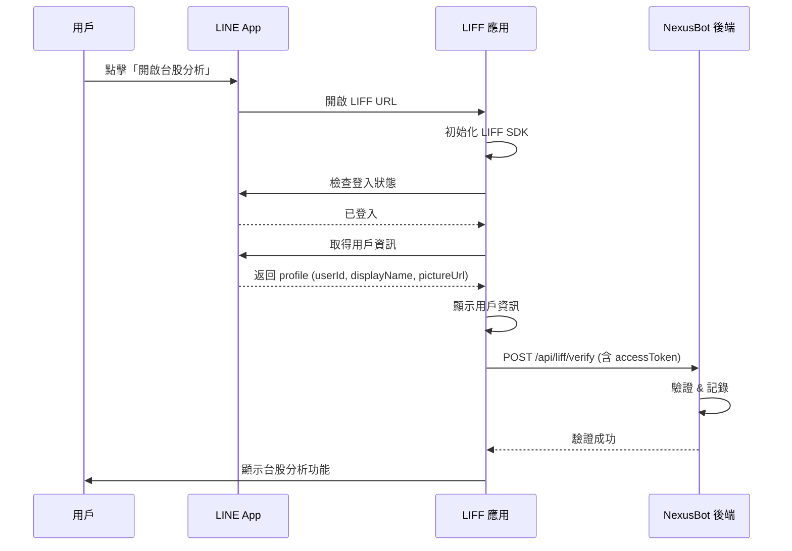

# LIFF (LINE Front-end Framework) 設定指南

## 什麼是 LIFF？

LIFF (LINE Front-end Framework) 是 LINE 官方提供的前端框架，讓你的 Web 應用可以在 LINE 內嵌瀏覽器中運行，並且能夠：

- **安全地獲取用戶資訊**（User ID、顯示名稱、頭像）
- **無需額外登入**（自動使用 LINE 帳號）
- **原生體驗**（在 LINE 內開啟，體驗流暢）
- **安全性高**（LINE 官方認證，防止偽造）

## NexusBot 中的 LIFF 應用

目前 NexusBot 使用 LIFF 實現 **台股分析** 功能，讓用戶在使用台股分析工具時能自動識別身份。

---

## 設定步驟

### 1. 前往 LINE Developers Console

1. 開啟瀏覽器，前往 [LINE Developers Console](https://developers.line.biz/console/)
2. 使用你的 LINE 帳號登入
3. 選擇你的 **Provider**（如果沒有，請先創建一個）
4. 選擇你的 **Messaging API Channel**（即你的 LINE Bot）

### 2. 創建 LIFF 應用

1. 在左側選單中，點擊 **"LIFF"** 頁籤
2. 點擊右上角的 **"Add"** 按鈕
3. 填寫 LIFF 應用設定：

#### LIFF 應用設定

| 欄位                   | 值                                                  | 說明                  |
|----------------------|----------------------------------------------------|---------------------|
| **LIFF app name**    | `NexusBot - 台股分析`                                  | 應用名稱（內部識別用）         |
| **Size**             | `Full`                                             | 視窗大小（建議選擇 Full 全螢幕） |
| **Endpoint URL**     | `https://your-ngrok-url.ngrok-free.app/stock.html` | 你的應用網址（見下方說明）       |
| **Scope**            | ☑ `profile`<br>☑ `openid`                          | 權限範圍（勾選這兩項）         |
| **Bot link feature** | `On (Normal)`                                      | 啟用後用戶可從 LIFF 返回聊天室  |
| **Scan QR**          | `Off`                                              | 不需要 QR Code 掃描功能    |
| **Module Mode**      | `Off`                                              | 不使用模組模式             |

#### 關於 Endpoint URL

- **本地開發**：使用 ngrok URL
    - 範例：`https://abc123.ngrok-free.app/stock.html`
    - ngrok 會在每次重啟時產生新的 URL，需要更新此欄位

- **生產環境**：使用你的正式域名
    - 範例：`https://your-domain.com/stock.html`

### 3. 取得 LIFF ID

1. 創建完成後，你會在 LIFF 列表中看到新建立的應用
2. 複製 **LIFF ID**（格式：`1234567890-abcdefgh`）
3. 保存此 ID，下一步會用到


### 4. 設定環境變數

#### 方法 A：修改 `config.local.bat`（Windows）

編輯 `docs/config.local.bat`，找到以下行並填入你的 LIFF ID：

```batch
set LINE_LIFF_STOCK_ANALYSIS_ID=1234567890-abcdefgh
```

#### 方法 B：設定系統環境變數

在命令提示字元（cmd）中執行：

```batch
setx LINE_LIFF_STOCK_ANALYSIS_ID "1234567890-abcdefgh"
```

#### 方法 C：修改 `bootstrap-local.yml`（不建議，因為會被 git 追蹤）

編輯 `src/main/resources/bootstrap-local.yml`：

```yaml
line:
  liff:
    stock-analysis-id: 1234567890-abcdefgh
```

### 5. 重新啟動應用

```bash
# 如果使用 Windows 啟動腳本
.\docs\windows_start_AceLineBot.bat

# 或使用 Gradle
./gradlew clean bootRun
```

---

## 驗證設定

### 1. 檢查應用日誌

啟動後查看日誌，應該會看到：

```
[INFO] [LiffConfig] LIFF Stock Analysis ID loaded: 1234567890-abcdefgh
```

如果看到錯誤訊息，檢查環境變數是否正確設定。

### 2. 測試 LIFF 功能

1. 在 LINE 中對 NexusBot 發送 `/stock`
2. Bot 應該回覆台股分析選單，包含 **"🚀 開啟台股分析"** 按鈕
3. 點擊按鈕，應該會在 LINE 內開啟 LIFF 應用
4. 應用會自動顯示你的 LINE 用戶資訊（頭像、名稱、User ID）

### 3. 檢查後端日誌

當你開啟 LIFF 應用時，後端日誌應該會記錄：

```
[INFO] [LIFF] Verify request received - userId=U1234567890, displayName=你的名稱
[INFO] [LIFF] User verified successfully - userId=U1234567890, displayName=你的名稱
```

---

## 技術細節

### LIFF 認證流程



### 安全性

- **Access Token**：LIFF SDK 自動生成短期 Access Token
- **後端驗證**：可選擇向 LINE API 驗證 Token 有效性
- **HTTPS Only**：LIFF 只能在 HTTPS 環境運行
- **Scope 控制**：明確定義應用可存取的用戶資訊範圍

---

## 參考資料

- [LINE LIFF 官方文件](https://developers.line.biz/en/docs/liff/overview/)
- [LIFF SDK 參考](https://developers.line.biz/en/reference/liff/)
- [LINE Developers Console](https://developers.line.biz/console/)
- [ngrok 官網](https://ngrok.com/)

---
